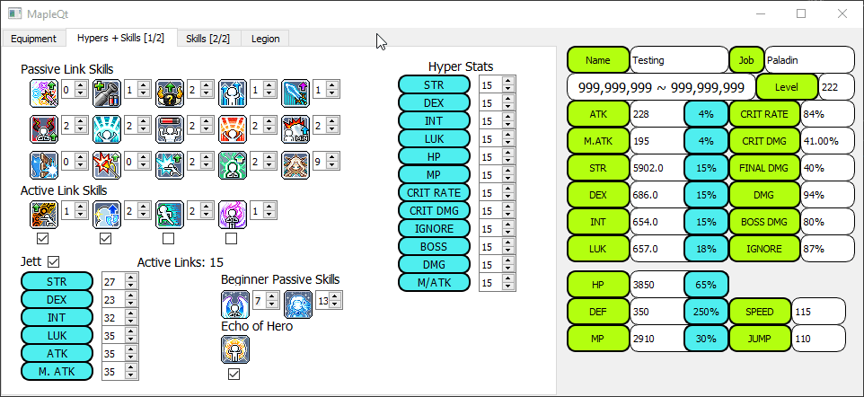
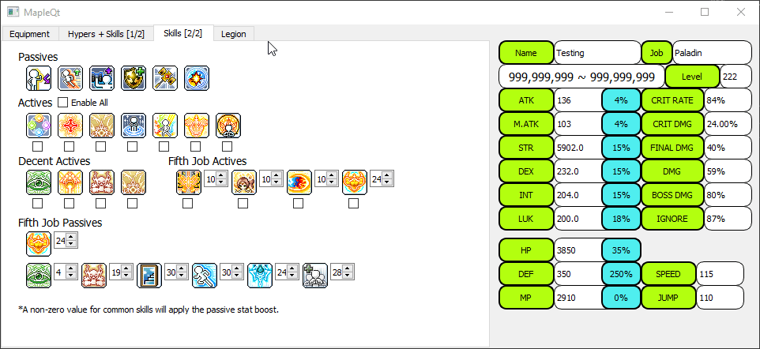
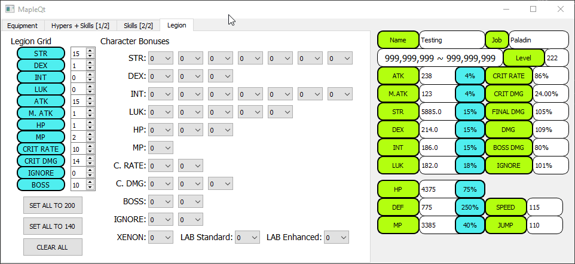

# MapleQt

This project was created to allow players of the game Maplestory easily track all of their characters stats, as the game does not show the player everything.
The program reads in equipment by using OpenCV to locate the in-game equip window, captures it, and sends it to Google Vision API which performs optical character recognition. 
All equipment and other stats are saved and loaded via MongoDB Atlas.
Using OCR was the main reason I created this application, as it was something I was interested in exploring.
The program also features Maplestory's other stat enhancing attributes which I have included as well (Links, Hypers, Skills, Legion).
Unfortunately Google Vision struggles with the font Maplestory uses so unless I can figure out a solution to that, I may not completely finish this project as I don't want to release a program that only works sometimes.

## Examples:

Reading in game equips:

Other tabs of the application:

Hyper Stats, Link Skills:

Class Skills:

Legion:

